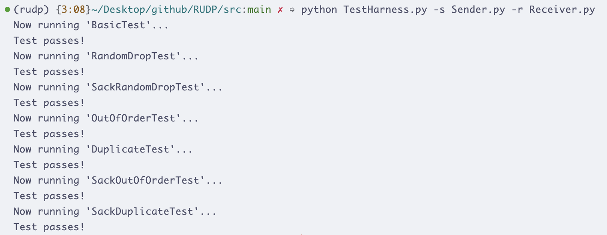

# 实验七：基于 UDP 实现可靠传输

## 1. 类定义和初始化

```python
class Sender(BasicSender):
    def __init__(self, dest, port, filename, debug=False, sackMode=False):
        super(Sender, self).__init__(dest, port, filename, debug)
        self.sackMode = sackMode
        self.debug = debug
        # 实现选择重传模式
        self.window_size = 5
        self.send_base = 0
        self.next_seq_num = 0
        self.packets = []  # 存储待发送的数据包
        self.acked = {}    # 记录已确认的包
        self.timers = {}   # 超时计时器
        self.sack_received = set()  # 选择确认集合
```

**说明**：初始化发送端，设置窗口大小为5，维护发送序列号、确认状态和超时计时器。

## 2. 文件读取和分段

```python
def read_file(self):
    with open(self.filename, 'rb') as f:
        data = f.read()
    # 分割数据为1472字节的块
    chunks = [data[i:i+1472] for i in range(0, len(data), 1472)]
    return chunks

def make_packet(self, msg_type, seq_num, data):
    msg = f"{msg_type}|{seq_num}|{data.decode('latin-1') if isinstance(data, bytes) else data}|"
    checksum = self.checksum(msg.encode('latin-1'))
    return f"{msg}{checksum}".encode('latin-1')
```

**说明**：读取文件并按最大1472字节分段，构建RUDP消息包，附加校验和。

## 3. Go-Back-N 发送逻辑

```python
def send_window_packets(self):
    while self.next_seq_num < self.send_base + self.window_size and self.next_seq_num < len(self.packets):
        packet = self.packets[self.next_seq_num]
        self.sock.sendto(packet, (self.dest, self.port))
        if self.next_seq_num not in self.timers:
            self.timers[self.next_seq_num] = time.time()
        self.next_seq_num += 1
```

**说明**：在窗口内发送数据包，启动超时计时器。

## 4. ACK 处理

```python
def handle_ack(self, ack_packet):
    parts = ack_packet.split('|')
    if len(parts) != 3:
        return
    ack_num = int(parts[1])
    checksum = parts[2]
    if not self.checksum_valid(ack_packet):
        return
    # 滑动窗口
    if ack_num > self.send_base:
        self.send_base = ack_num
        # 清除已确认包的计时器
        for seq in list(self.timers.keys()):
            if seq < ack_num:
                del self.timers[seq]
```

**说明**：验证ACK校验和，滑动发送窗口，清除相应计时器。

## 5. SACK 处理

```python
def handle_sack(self, sack_packet):
    if not self.sackMode:
        return
    parts = sack_packet.split('|')
    cum_ack = int(parts[1].split(';')[0])
    sacks = parts[1].split(';')[1].split(',') if ';' in parts[1] else []
    # 更新累积确认
    if cum_ack > self.send_base:
        self.send_base = cum_ack
    # 记录选择确认
    for sack in sacks:
        if sack:
            self.sack_received.add(int(sack))
```

**说明**：解析SACK消息，更新累积确认和选择确认集合。

## 6. 超时重传

```python
def check_timeouts(self):
    current_time = time.time()
    for seq, send_time in list(self.timers.items()):
        if current_time - send_time > 0.5:  # 500ms超时
            if self.sackMode:
                # 选择重传：只重传未确认的包
                if seq not in self.sack_received:
                    self.sock.sendto(self.packets[seq], (self.dest, self.port))
                    self.timers[seq] = current_time
            else:
                # Go-Back-N：重传从send_base开始的所有包
                for i in range(self.send_base, min(self.send_base + self.window_size, len(self.packets))):
                    self.sock.sendto(self.packets[i], (self.dest, self.port))
                    self.timers[i] = current_time
                break
```

**说明**：检查超时包，根据模式（Go-Back-N或选择重传）进行重传。

## 7. 主发送循环

```python
def start(self):
    self.packets = [self.make_packet('start', 0, '0')]  # start包
    chunks = self.read_file()
    for i, chunk in enumerate(chunks):
        self.packets.append(self.make_packet('data', i+1, chunk))
    self.packets.append(self.make_packet('end', len(chunks)+1, chunks[-1] if chunks else ''))  # end包
    
    self.send_window_packets()
    
    while self.send_base < len(self.packets):
        ready, _, _ = select.select([self.sock], [], [], 0.1)
        if ready:
            data, addr = self.sock.recvfrom(4096)
            msg = data.decode('latin-1')
            if msg.startswith('ack|'):
                self.handle_ack(msg)
            elif msg.startswith('sack|'):
                self.handle_sack(msg)
        self.check_timeouts()
        self.send_window_packets()
```

**说明**：构建所有数据包，循环发送、接收ACK和处理超时，直到所有包确认。

## 测试成功截图

</content>
<parameter name="filePath">/Users/chenjane/Desktop/github/RUDP/实验报告.md
